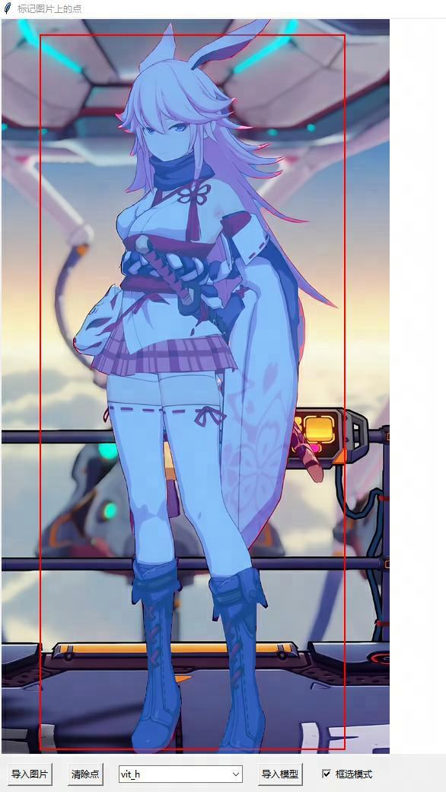
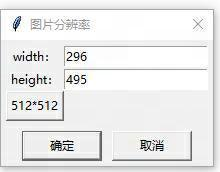

# SAM_Extracter
基于[Segment Anything Model(SAM)](https://github.com/facebookresearch/segment-anything)图片元素提取器

若不清楚SAM的功能，建议体验其[Demo](https://segment-anything.com/demo)进行了解，本仓库实现了本地版本的对应功能，并优化了图片分割的体验

## 安装

> 建议安装[miniconda](https://docs.conda.io/en/latest/miniconda.html)管理python环境

1. 本地部署SAM，参考[segment-anything](https://github.com/facebookresearch/segment-anything)
2. 安装依赖，建议`python=3.10`， `pip install -r requirement.txt `
3. 修改`marker.py`中 `sam_root = ""` 为本地SAM根目录，并将模型文件放在本地SAM根目录的models下（这步如果不确定具体位置，可以先进行下一步，会有相关提示）
4. `python marker.py`启动ui界面

（有条件的朋友建议安装cuda，cudnn，torch-cuda）

## 使用指南

+ 选择【导入模型】左侧的具体模型（质量h > l > b），并点击导入模型

+ 选择导入图片，或直接将图片拖入框内，这一步会耗费一些时间（10s-20s，视GPU能力）

+ 开始抠图：

  + 框选模式：利用box选择分割区域
  + 点选模式（非框选模式）
    + 左键加入前景点（需要提取的部分）
    + 右键加入后景点（希望剔除的部分）
    + 中键删除前景点、后景点

+ 保存：按住Ctrl，并用左键点击选择想保存的区域（如果没有选中对应的mask区域，没有反应）

  + 弹出保存分辨率框：默认为当前mask的包围盒大小，可快速选择对应分辨率，也可自行输入分辨率，保存时会自动进行调整，非mask区域自动填充黑色

    

  + 选择文件夹并保存，继续提取元素或者处理下一张图

